<div align="center">



<br/>


<br/><br/>


</div>

---

## `WHOAMI`

```bash
> INITIALIZING SYSTEM...
[OK] Loading profile: Adryan Silva Santos
[OK] Role: Data Analyst & Automation Engineer
[OK] Objective: Transforming manual processes into automated, data-driven systems
[INFO] Specializing in healthcare data operations and business intelligence
```

## `TECH ARSENAL`

<div align="center">


<br/><br/>


</div>

## `CORE METRICS & DATA PIPELINES`

<div align="center">


<br/><br/>


</div>

## `ACTIVITY LOG`

<div align="center">


</div>

## `OPERATIONAL MODULES`

<table align="center">
<tr>
<td align="center" width="25%">

**🧠 Data Engine**
<br/>
ETL Processes
<br/>
Data Cleaning
<br/>
Relational DBs

</td>
<td align="center" width="25%">

**⚙️ Automation Bot**
<br/>
Python Scripts
<br/>
Triggers & Macros
<br/>
Apps Script API

</td>
<td align="center" width="25%">

**📈 BI Interface**
<br/>
Dashboard Rendering
<br/>
KPI Monitoring
<br/>
Data Viz

</td>
<td align="center" width="25%">

**🏥 Health Ops**
<br/>
System Integration
<br/>
Workflow Logic
<br/>
Process Efficiency

</td>
</tr>
</table>

## `DEPLOYED REPOSITORIES`

<div align="center">

<a href="https://github.com/AdryanSilva1/github.com-adryan-silva-sus-hospital-analytics-sc">

</a>

<a href="https://github.com/AdryanSilva1/automacao-relatorios-vendas">

</a>

<a href="https://github.com/AdryanSilva1/python-estudos">

</a>

<a href="https://github.com/AdryanSilva1/dio-sistema-bancario">

</a>

</div>

## `CONTRIBUTION GRID`

<div align="center">


</div>

## `CERTIFICATIONS DATABASE`

<div align="center">


</div>

## `ESTABLISH CONNECTION`

<div align="center">

<a href="https://www.linkedin.com/in/adryan-silva-santos">

</a>

<a href="mailto:adryandasilvasantos12@gmail.com">

</a>

</div>

<div align="center">

```bash
[SYSTEM] Execution successful. Transforming data into actionable solutions...
```


</div>
